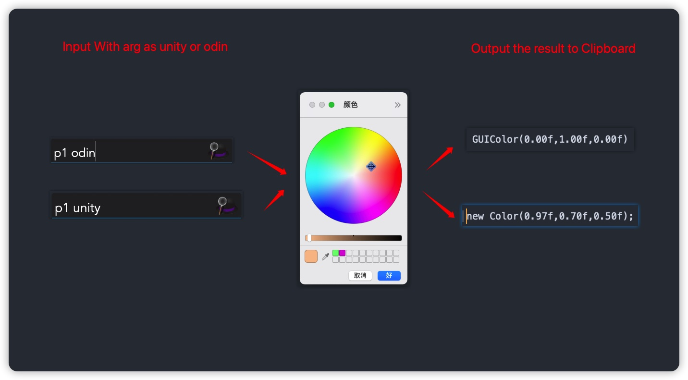
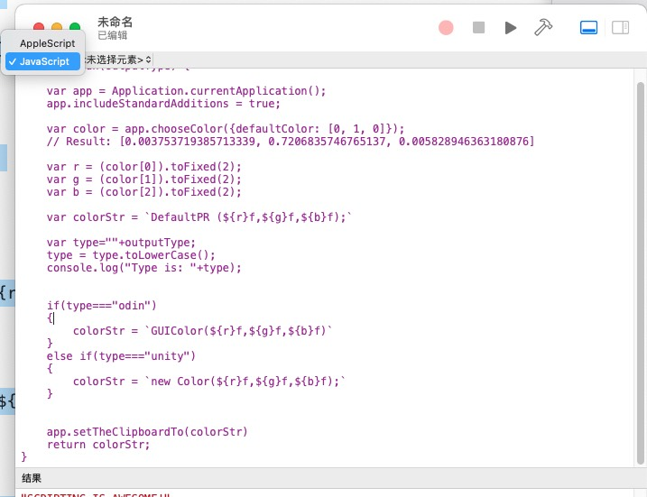
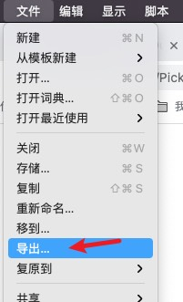
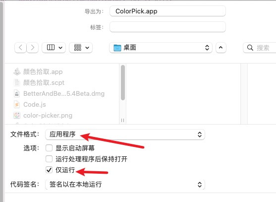
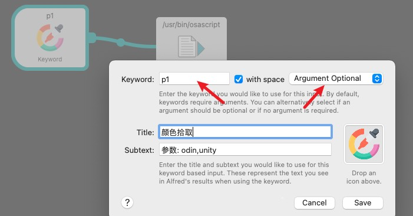

# ColorPickerForUnity
color picker output result for unity &amp; odin (out put as GUIColor &amp; Color)

# 限制

- 代码仅限于MacOS

# 作用

- 选取相应的颜色,并且根据给定的`Output`参数,将结果复制到剪贴板内
- 内置的参数类型为`Odin` 和 `Unity`
- 参数不区分大小写

# 如何使用

## 导出App(Automation)

- [参考Link1](https://developer.apple.com/library/archive/documentation/LanguagesUtilities/Conceptual/MacAutomationScriptingGuide/index.html#//apple_ref/doc/uid/TP40016239-CH56-SW1)
- [参考Link2](https://developer.apple.com/library/archive/documentation/LanguagesUtilities/Conceptual/MacAutomationScriptingGuide/PromptforaColor.html)

- 把代码复制到脚本编辑器内
- 

- (可选)替换掉输出的字符串

- 选择导出
- 

- 导出本地签名的App
- 

- 快乐的使用起来

## Alfred 工作流

- 创建Trigger/HotKey 输出自己要用的Key 选择需要参数
- 
- 第二个节点选择Action/Run Script 粘贴脚本
- 
- 快乐的使用起来

